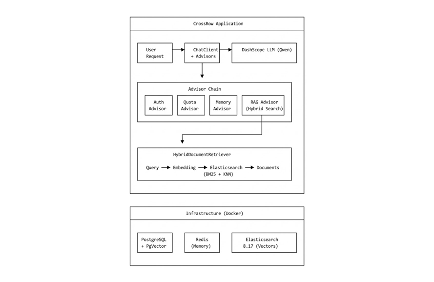

# CrossRow

A Spring Boot AI application that combines LLM capabilities with RAG (Retrieval Augmented Generation) to provide philosophical guidance and life strategy advice.

> **Status**:  Under Active Development

## Todo List
- [ ] Persistence of conversation sessions allows users to have multiple different conversations with isolation.
- [ ] implement tool class that enable agent to access/modify documents
- [ ] implement full frontend/backend service
- [ ] Add separate model calls and isolation for tenants.
- [ ] Implement hot restart for appropriate services such as tenant model configuration.
- [ ] To enable on-demand and configuration-based invocation of multiple models, a routing class and interface need to be implemented.
## Overview

CrossRow is an AI-powered "Rational Life Strategist" that helps users navigate real-world challenges by combining:
- Large Language Model conversations with memory
- Philosophy-based knowledge retrieval (RAG)
- Hybrid search (semantic + keyword) powered by Elasticsearch

The system is designed to accept the user's described reality as absolute truth and provide logical, actionable solutions rather than emotional comfort.

## Features

### Completed

- **LLM Integration**: Chat with Google Gemini models via Vertex AI
- **Conversation Memory**: Persistent chat history via Redis
- **RAG Pipeline**: Retrieve relevant philosophical concepts to augment responses
- **Dual Vector Store Support**:
  - PgVector (PostgreSQL with vector extension)
  - Elasticsearch with hybrid search (BM25 + KNN)
- **Document Processing**: Automatic loading and chunking of Markdown knowledge base
- **Keyword Extraction**: AI-powered keyword enrichment for documents
- **Custom Advisors**:
  - Authentication advisor
  - Quota management advisor
  - Logging advisor
  - Re-reading advisor (query enhancement)

### Planned

- [ ] Agent framework with tool calling
- [ ] Image generation (Nano Banana)
- [ ] MCP (Model Context Protocol) integration
- [ ] Full-stack web interface
- [ ] Multi-turn reasoning chains

## Architecture

1. hybrid RAG

2. 
3. 

## Tech Stack

| Component | Technology |
|-----------|------------|
| Framework | Spring Boot 3.2.4 |
| AI Framework | Spring AI 1.1.0 |
| LLM Provider | Google Vertex AI (Gemini 2.0 Flash) |
| Embedding Model | Vertex AI text-embedding-005 (768 dims) |
| Vector Store | PostgreSQL + PgVector / Elasticsearch 8.17 |
| Chat Memory | Redis |
| Containerization | Docker Compose |
| Java Version | 21 |

## Knowledge Base

The RAG system is powered by a curated collection of philosophical frameworks:

Existentialism, Stoicism, Buddhism, Confucianism, Taoism, Epicureanism, Kantianism, Pragmatism, Pessimism, Post-modernism, Transhumanism, Will to Power (Nietzsche)

## Project Structure

```
src/main/java/com/dyx/crossrow/
├── app/                    # Main application logic
├── advisor/                # Custom Spring AI advisors
│   ├── MyLogAdvisor.java
│   ├── ReReadingAdvisor.java
│   ├── SimpleAuthAdvisor.java
│   └── SimpleQuotaAdvisor.java
├── chatmemory/             # Chat memory implementations
│   ├── FileBasedChatMemory.java
│   └── RedisChatMemory.java
├── config/                 # Configuration classes
│   ├── ElasticSearchConfiguration.java
│   ├── HybridRagConfiguration.java
│   ├── PgVectorConfiguration.java
│   ├── VertexAiConfiguration.java
│   └── ...
├── elasticsearch/          # Elasticsearch integration
│   ├── CrossRowDocument.java
│   ├── ElasticsearchDocumentStore.java
│   └── ElasticsearchIndexManager.java
├── rag/                    # RAG components
│   ├── CrossRowDocumentLoader.java
│   ├── DocumentIndexer.java
│   └── SimpleKeyWordEnricher.java
└── retriever/              # Document retrievers
    └── HybridDocumentRetriever.java
```

## Getting Started

### Prerequisites

- Java 21
- Docker & Docker Compose
- Google Cloud Project with Vertex AI API enabled
- GCP Service Account Key (JSON)

### Setup

1. **Clone the repository**
   ```bash
   git clone https://github.com/yourusername/CrossRow.git
   cd CrossRow
   ```

2. **Start infrastructure services**
   ```bash
   docker-compose up -d
   ```

3. **Configure Google Cloud credentials**
   
   Option A: Place your service account key file:
   ```bash
   mkdir -p config
   cp /path/to/your-service-account-key.json config/gcp-key.json
   ```
   
   Option B: Use Application Default Credentials:
   ```bash
   gcloud auth application-default login
   ```

4. **Configure application**
   
   Create `src/main/resources/application-local.yml`:
   ```yaml
   gcp:
     credentials:
       location: file:./config/gcp-key.json
   
   spring:
     ai:
       vertex:
         ai:
           gemini:
             project-id: your-gcp-project-id
             location: us-central1
             chat:
               options:
                 model: gemini-2.5-flash
           embedding:
             project-id: your-gcp-project-id
             location: us-central1
             text:
               options:
                 model: text-embedding-005
   ```

5. **Run the application**
   ```bash
   ./mvnw spring-boot:run
   ```

### Docker Services

| Service | Port | Purpose |
|---------|------|---------|
| PostgreSQL + PgVector | 5432 | Vector storage (alternative) |
| Redis | 6379 | Chat memory persistence |
| Elasticsearch | 9200 | Hybrid vector + text search |

## API Endpoints

| Method | Endpoint | Description |
|--------|----------|-------------|
| POST | `/chat` | Basic chat with memory |
| POST | `/chat/rag` | Chat with RAG augmentation |
| POST | `/chat/report` | Generate structured report |

## Configuration

Key configuration properties in `application-local.yml`:

```yaml
gcp:
  credentials:
    location: file:./config/gcp-key.json

spring:
  elasticsearch:
    host: localhost
    port: 9200
    index-name: philosophy_docs
    
  ai:
    vertex:
      ai:
        gemini:
          project-id: ${GOOGLE_CLOUD_PROJECT_ID}
          location: us-central1
        embedding:
          project-id: ${GOOGLE_CLOUD_PROJECT_ID}
          location: us-central1
```

## Development Notes

### Hybrid Search Implementation

The system uses Elasticsearch's bool query with should clauses to combine:
- **BM25**: Traditional keyword matching on `content` field with IK analyzer (Chinese)
- **KNN**: Dense vector similarity on `embedding` field (768 dimensions)

Note: RRF (Reciprocal Rank Fusion) requires an Elasticsearch paid license, so the current implementation uses score combination via bool should.

### Document Processing Pipeline

```
Markdown Files ──▶ DocumentLoader ──▶ KeywordEnricher ──▶ EmbeddingModel ──▶ Elasticsearch
                   (chunk by Q&A)    (AI extraction)     (Vertex AI)        (index)
```

### Migration Notes

This project was migrated from DashScope (Alibaba Cloud) to Google Vertex AI (Gemini). Key changes:
- Embedding dimensions changed from 1024 to 768
- Vector store tables need to be recreated after migration
- GCP service account credentials required

## License

[MIT License](LICENSE)

## Acknowledgments

- [Spring AI](https://docs.spring.io/spring-ai/reference/)
- [Google Vertex AI](https://cloud.google.com/vertex-ai)
- [Gemini API](https://ai.google.dev/)
